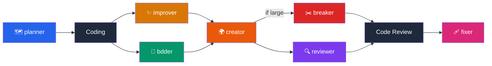

# AI Skills

<div align="center">
  
</div>

<div align="center">


</div>

A collection of reusable prompts and skills for software development workflows.

This repository supports:

- **Codex CLI** — skills installed into `~/.codex/skills/<skill-name>/SKILL.md`
- **Claude Code** — compatibility command files installed into `.claude/commands/` and invoked as `/creator`, `/planner`, etc.

> [!TIP]
> Quick start:
> - Codex CLI: `python3 "$SKILLS_PATH/scripts/sync.py" --install --codex`
> - Claude Code: `cd <your-project>` then `python3 "$SKILLS_PATH/scripts/sync.py" --install --claude`

> [!NOTE]
> Every skill is a template. Fork this repo, tweak the prompts to match your team's conventions, and commit your own version.

> [!IMPORTANT]
> Pre-requisite: Add the `SKILLS_PATH` ENV to your bash profile:
> ```bash
> export SKILLS_PATH="/abs/path/to/this/repository/skills"
> ```

---

## 🧠 Skills

| Skill | Command | Purpose | Status |
|-------|---------|---------|--------|
| 🗺️ Planner | `/planner` | Plan tasks in sections, execute with approval gates | 🟢 Ready |
| ✨ Improver | `/improver` | Review code and fix all found issues directly | 🟢 Ready |
| 🧪 BDDer | `/bdder` | Improve tests using Behavior Driven Development | 🟢 Ready |
| 🌍 Creator | `/creator` | Generate PR descriptions & titles from diffs | 🟢 Ready |
| ✂️ Breaker | `/breaker` | Split large PRs into smaller, reviewable units | 🟡 Pending |
| 🩹 Fixer | `/fixer` | Resolve PR review comments interactively | 🟢 Ready |
| 🔍 Reviewer | `/reviewer` | Review code and post inline PR comments with code suggestions for each approved finding | 🟢 Ready |

---

## Workflow



---

## 🔧 Installation

### 🌍 Codex CLI - Globally

```bash
python3 "$SKILLS_PATH/scripts/sync.py" --install --codex
```

This installs every skill from `skills/*` into `~/.codex/skills/<skill-name>/SKILL.md`.

Restart Codex CLI to pick up the new skill.

### 🖥️ Claude Code - Locally

From the root of any target repository:

```bash
python3 "$SKILLS_PATH/scripts/sync.py" --install --claude
```

This writes each skill into `<project>/.claude/commands/<skill>.md` with YAML frontmatter removed for Claude command compatibility.

### ⚡ Install all at once

```bash
python3 "$SKILLS_PATH/scripts/sync.py" --install
```

This installs Claude and Codex targets.

### 🔍 Dry run (print paths without writing)

```bash
python3 "$SKILLS_PATH/scripts/sync.py"
```

---

## 🚀 Usage

### 🌍 Codex CLI

```bash
cd <your-project>
codex
# then call it explicitly:
Use the planner skill to plan the implementation of the new feature
# or:
Use the creator skill to generate a PR title and description
```

### 🖥️ Claude Code

```bash
cd <your-project>
claude
# then invoke:
/planner
/creator
/bdder
```

---

## 📖 Skill Descriptions

- 🗺️ **Planner** — Investigates the codebase, plans tasks in structured checkpoint-driven sections saved as `PLAN.md`, then executes section by section with human approval gates.
- ✨ **Improver** — Reviews branch code for Clean Code violations, security vulnerabilities, performance issues, and convention mismatches, then walks through each finding interactively — proposing fixes with diffs and applying them upon approval.
- 🧪 **BDDer** — Analyzes changed tests and applies Behavior Driven Development improvements directly.
- 🌍 **Creator** — Reads the current diff / branch and produces a well-structured PR title and description following your team's template.
- ✂️ **Breaker** — Analyzes a large PR and proposes a plan to split it into smaller, independently reviewable pull requests.
- 🩹 **Fixer** — Fetches review comments from a GitHub PR, filters actionable feedback, proposes up to three solutions per comment, and walks through an interactive resolution flow with apply/skip/custom options.
- 🔍 **Reviewer** — Reviews branch code for Clean Code violations, security vulnerabilities, performance issues, and convention mismatches, then walks through each finding interactively — posting inline PR comments with code suggestions upon approval, without modifying local files.

---

## Example Usage

```bash
# 🗺️ Plan a new feature
claude /planner

# ✨ Review and auto-fix issues in one step
claude /improver

# 🧪 Write code, then improve tests
claude /bdder

# 🌍 Generate the PR description
claude /creator

# ✂️ If the PR is too large
claude /breaker

# 🩹 After receiving review feedback
claude /fixer

# 🔍 Review your own changes
claude /reviewer
```

---

> *"Reusable prompts turn tribal knowledge into shared infrastructure. Write the prompt once, improve it forever."*

---

## Contributing

Contributions are welcome! If you have a skill that fits the development workflow, open a PR with:

1. A new skill folder under `skills/<skill-name>/SKILL.md`
2. A corresponding `skills/<skill-name>/agents/openai.yaml`
3. An updated entry in the skills table above

Then run:

```bash
python3 scripts/sync.py --write
```
