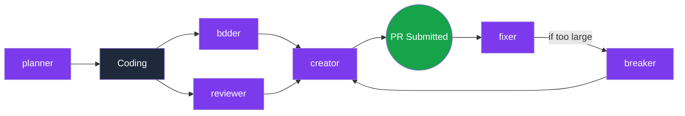

# skills


A collection of reusable prompts and skills for software development workflows, designed for use with [Claude Code](https://docs.anthropic.com/en/docs/claude-code). Each skill encapsulates best practices for a specific phase of the development lifecycle -- from planning features to splitting oversized PRs.

> [!TIP]
> **Quick start** -- invoke any skill directly inside Claude Code:
> ```bash
> claude /creator    # generate a PR title & description
> claude /reviewer   # run a code review
> ```

> [!NOTE]
> Every skill is a template. Fork this repo, tweak the prompts to match your team's conventions, and commit your own version.

---

## Skills

| Skill | Command | Purpose | Status |
|-------|---------|---------|--------|
| Creator | `/creator` | Generate PR descriptions & titles from diffs | 🟡 Pending |
| Breaker | `/breaker` | Split large PRs into smaller, reviewable units | 🟡 Pending |
| Reviewer | `/reviewer` | Review code for Clean Code, Security & Performance | 🟡 Pending |
| BDDer | `/bdder` | Improve tests using Behavior Driven Development | 🟡 Pending |
| Planner | `/planner` | Break down features into implementation steps | 🟡 Pending |
| Fixer | `/fixer` | Resolve PR review feedback efficiently | 🟡 Pending |
| Improver | `/improver` | Review code and fix all found issues directly | 🟡 Pending |

---

## Workflow



---

<details>
<summary><strong>Installation & Setup</strong></summary>

### 1. Clone the repository

```bash
git clone https://github.com/<your-user>/skills.git
```

### 2. Use the skills in any project

**Option A -- Symlink the commands directory:**

```bash
# From your target project root
ln -s /path/to/skills/.claude/commands .claude/commands
```

**Option B -- Copy individual skills:**

```bash
mkdir -p .claude/commands
cp /path/to/skills/.claude/commands/reviewer.md .claude/commands/
```

### 3. Invoke with Claude Code

```bash
claude           # start Claude Code
# then type:
/reviewer        # run the reviewer skill
/creator         # generate a PR description
```

</details>

<details>
<summary><strong>Skill Descriptions</strong></summary>

- **Creator** -- Reads the current diff / branch and produces a well-structured PR title and description following your team's template.
- **Breaker** -- Analyzes a large PR and proposes a plan to split it into smaller, independently reviewable pull requests.
- **Reviewer** -- Performs a code review focused on Clean Code principles, security vulnerabilities, and performance concerns.
- **BDDer** -- Examines existing tests and suggests improvements using Behavior Driven Development patterns (Given / When / Then).
- **Planner** -- Takes a feature request and breaks it down into concrete implementation steps with checkmarks.
- **Fixer** -- Reads PR review comments and produces best-practice fixes for each piece of feedback.
- **Improver** -- Like Reviewer, but goes further: reviews code for Clean Code, Security, and Performance issues and applies the fixes directly.

</details>

---

## Example Usage

```bash
# Plan a new feature
claude /planner

# Write code, then improve tests
claude /bdder

# Review your own changes before opening a PR
claude /reviewer

# Generate the PR description
claude /creator

# After receiving review feedback
claude /fixer

# If the PR is too large
claude /breaker

# Review and auto-fix issues in one step
claude /improver
```

---

> *"Reusable prompts turn tribal knowledge into shared infrastructure. Write the prompt once, improve it forever."*

---

## License

This project is licensed under the [MIT License](https://opensource.org/licenses/MIT).

## Contributing

Contributions are welcome! If you have a skill that fits the development workflow, open a PR with:

1. A new `.md` file in `.claude/commands/`
2. An updated entry in the skills table above
