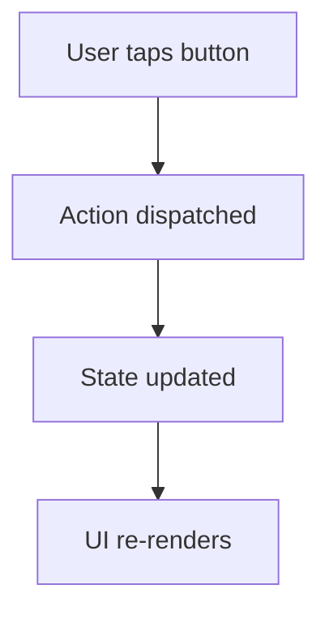

# ✂️ Breaker

> **Purpose**: Guide the full PR lifecycle — from resolving the base branch and checking size limits, through writing the PR description, to opening the PR with `gh pr create`. Splits oversized diffs into independent, SRP-based branches before doing anything else.

---

## Input

| Parameter | Required | Default |                                                  Description                                                  |
|-----------|----------|---------|---------------------------------------------------------------------------------------------------------------|
|   `MAX`   |    No    |  `900`  | Maximum lines permitted per PR (including tests). Pass as the first argument: `/breaker 900`, `$breaker 900`. |

If the user provides an integer argument, use it as `MAX`. Otherwise default to **900**.

---

## Resolve the base branch

Before doing anything else, fetch remote refs and resolve the base:

```bash
git fetch --all --prune

BASE_REF=""
for ref in upstream/main upstream/master origin/main origin/master; do
  git rev-parse --verify --quiet "$ref" >/dev/null && BASE_REF="$ref" && break
done
echo "$BASE_REF"   # e.g. upstream/master or upstream/main
```

Store `BASE_REF` and use it throughout (size checks, diffs, PR `--base` flag).

---

## Size limit

- Max **MAX lines per PR** (including tests) — verified by running `git diff $(git merge-base HEAD "$BASE_REF")..HEAD --numstat | awk '{a+=$1;d+=$2} END{print a+d}'`
- **Check this before doing anything else.** If the total exceeds MAX, split into independent PRs following the SRP workflow below

### SRP split workflow

> **This is the most critical part of the breaker skill. Follow it rigorously.**

When the diff exceeds MAX lines, do **not** create dependent/chained branches. Instead, split the work into **independent, self-sufficient PRs** following the Single Responsibility Principle:

#### 1. Analyze the mother branch

Read every changed file in the diff. Understand the full scope of work — models, services, UI, tests, configs, migrations, etc.

#### 2. Identify semantic boundaries

Group changes by **responsibility**, not by file order or directory. Each group must represent a single, coherent purpose. Good boundaries include:

- A new model/entity + its tests
- A service/use-case + its tests
- A UI component/screen + its tests
- A refactor that enables the feature (extract, rename, restructure) + its tests
- A migration or config change + its tests
- An integration layer (API calls, state management) + its tests

#### 3. Draft a split plan and present it to the developer

Before creating any branch, present the proposed split as a numbered list:

```
Split plan for <branch-name> (TOTAL lines):

  PR 1 — "<short description>" (~NNN lines)
         Files: ...
  PR 2 — "<short description>" (~NNN lines)
         Files: ...
  ...
  Total: TOTAL lines (must match mother branch)
```

**Wait for the developer to approve or adjust the plan before proceeding.**

#### 4. Rules for each child PR

- **Independent**: every PR must build, pass tests, and be mergeable on its own — no PR depends on another PR in the split
- **Self-sufficient**: each PR contains both the implementation **and** all related automated tests for that implementation
- **Single responsibility**: each PR has one clear purpose described in its title
- **All target `$BASE_REF`**: every child branch is created from `$BASE_REF` and its PR targets `$BASE_REF`
- **Within MAX**: every child PR must be ≤ MAX lines

#### 5. Integrity verification (mandatory)

After splitting, verify that the union of all child branches reproduces **exactly** the same changes as the mother branch. Run this check:

```bash
# Count lines in the mother branch
MOTHER_LINES=$(git diff $(git merge-base HEAD "$BASE_REF")..HEAD --numstat | awk '{a+=$1;d+=$2} END{print a+d}')

# Count lines across all child branches (sum each child's diff against $BASE_REF)
CHILDREN_LINES=0
for branch in <child-branch-1> <child-branch-2> <child-branch-3>; do  # adjust branch names
  CHILD=$(git diff $(git merge-base "$branch" "$BASE_REF").."$branch" --numstat | awk '{a+=$1;d+=$2} END{print a+d}')
  CHILDREN_LINES=$((CHILDREN_LINES + CHILD))
done

echo "Mother: $MOTHER_LINES | Children total: $CHILDREN_LINES"
```

- If `CHILDREN_LINES == MOTHER_LINES` → the split is correct
- If they differ → the split is **wrong**. Investigate which changes were lost or duplicated and fix before opening any PR
- **No changes may be added or removed during the split** — the children must be a perfect partition of the mother

#### 6. Branch naming

Use descriptive names that reflect each PR's responsibility:

```
<original-branch>/split-add-user-model
<original-branch>/split-user-service
<original-branch>/split-user-ui
```

---

## PR Title

- Format: `[CI SKIP] PREFIX-XXXX <plain-language summary>` — e.g. `[CI SKIP] DIGIT-3121 Add offline support for map view` or `[CI SKIP] DPMS-42 Fix session timeout`
- Extract the ticket number from the branch name (see **Ticket number** section below) before writing the title
- Title must be a short, plain-language summary of the change (no conventional commits style required)

## PR Description

- Write for **non-technical stakeholders** (QA, PO): explain *what* changed and *why*, not *how*
- Avoid deep technical jargon; a QA engineer or Product Owner must understand the purpose without reading code

## Ticket number

1. Extract from the branch name using the case-insensitive regex `([A-Z]+)-?(\d+)` (matches `DIGIT-3023`, `digit3023`, `digit-3023`, `DPMS-42`, `dpms42`, `DUV-100`, `duv-100`, `duv100`, `ETC-7`, `etc7`, etc.) — normalise to `UPPERCASE-NUMBER` in the PR title (e.g. `dpms42` → `DPMS-42`, `duv100` → `DUV-100`)
2. If the branch name does not match, ask the developer for the ticket number
3. If the developer does not know the ticket number, omit it from both the PR title and the Plane Ticket section — **do not write any placeholder text** such as "No ticket number provided"; remove the section entirely

---

## Opening the PR

Always write the PR body to a temp file and use `--body-file`. Never pass the body inline with `--body "..."` because PR descriptions contain markdown backticks that trigger the backtick-command-substitution hook.

```sh
cat > /tmp/pr_body.md << 'ENDBODY'
# Description ✍️
...
ENDBODY

gh pr create \
  --repo oxeanbits/digitalize-front \
  --base "$(echo "$BASE_REF" | sed 's|.*/||')" \
  --head tiagogoncalves:branch-name \
  --title "[CI SKIP] PREFIX-XXXX Summary" \
  --body-file /tmp/pr_body.md
```

---

## PR Template

Use `.github/pull_request_template.md` as the base and fill each section following the rules below.
The Plane Ticket section is always the **last** section of the description — omit it entirely when no ticket number is available.

### Description ✍️

- Plain language, no jargon — written for QA and PO
- Use a `> [!NOTE]` alert to highlight the core problem being solved
- If the change has a visible user impact, state it in one sentence

### Overview 🔍

- Leave a `<details>` collapsible placeholder for screenshots/GIFs with a `| Before | After |` table — the developer fills these in, the agent cannot capture UI
- If the diff contains flow or architecture changes (new Redux actions, navigation paths, service calls, state transitions), **generate** a `mermaid` diagram inside a `<details>` block derived from the code:



- Use fenced code blocks with language tags for any inline code snippets (e.g. ` ```dart `)
- Use `> [!WARNING]` for known limitations or risks reviewers must be aware of

### How to Test 🧪

Write numbered, step-by-step smoke test instructions derived from the diff:
- Each step must be actionable: *navigate to X*, *tap Y*, *verify Z*
- Add an **Expected result** line after steps that are non-obvious
- Use `> [!IMPORTANT]` before the list to signal reviewers to follow carefully
- Cover both happy path and at least one edge/failure case visible in the diff

---

## Uncommitted changes

Before running the pre-submit checklist, check for uncommitted work:

1. Run `git status` to detect staged, unstaged, or untracked changes
2. If any exist, **ask the developer only**: which files should be included in this commit?
3. Wait for confirmation before staging anything
4. Generate the commit message from the diff following the PR title format defined in this doc — do not ask the developer for it
5. Only then proceed to the checklist below

Never assume all uncommitted changes belong to the current PR — the developer may have unrelated work in progress.

---

## Pre-submit checklist

**Do not open the PR until every item below passes.**

### Size gate

```sh
git diff $(git merge-base HEAD "$BASE_REF")..HEAD --numstat | awk '{a+=$1;d+=$2} END{print a+d}'
```

- [ ] ACK: PR is within MAX lines — if NAK, stop and run the SRP split workflow first

For split PRs, also verify integrity:

- [ ] ACK: sum of all child PR lines == mother branch lines — if NAK, changes were lost or duplicated during the split
- [ ] ACK: every child PR is independent, self-sufficient, and within MAX lines

Review the full diff against every rule defined in:

- `docs/agents/styling.md` — style constants, prohibited inline usages
- `docs/agents/structure.md` — naming, directory placement, import order
- `docs/agents/workflow.md` — test coverage, lint, formatting commands
- `docs/agents/testing.md` — test patterns, naming, mock usage

### BDD compliance

Before opening the PR, verify:

- [ ] Test file exists and was created before the implementation
- [ ] Every `test()` name describes an observable behavior, not a method or return value
- [ ] Each scenario has a corresponding `group` context (e.g. `when X is dispatched`, `when user has no profile picture`)
- [ ] No test asserts on implementation details (internal method calls, private state)
- [ ] `MockData` factory used for model construction — no inline `Record(...)` / `User(...)` scattered across the file
- [ ] 100% coverage on all modified classes confirmed by running `flutter test`

Fix any violation found before opening the PR.
